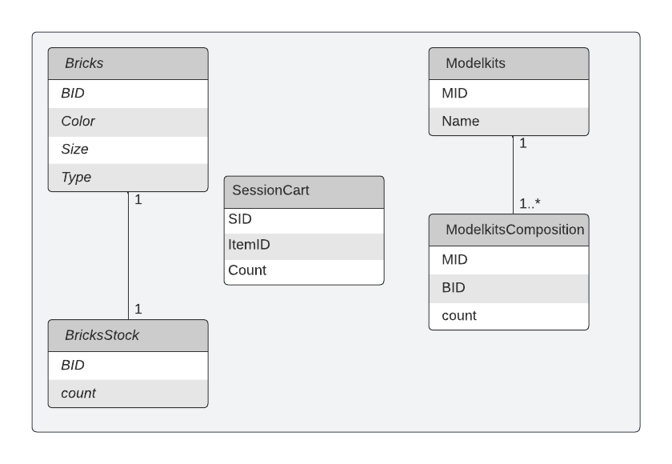

# Online shop
This is a sample online shop that offers features such as product catalog, shopping cart, checkout and payments

# Features
- User Sign up and authentication
- Password Reset
- Product Catalog \w pagination
- Shopping Cart and Checkout
- Email Notifications
- Image Uploads
- Stripe Payment Integration

## Getting Started

Follow instructions below to have a copy of this project up and running on your local machine for development and testing purposes. 

### Prerequisites

You will need to have the following software installed on your system

- [Nodejs](https://nodejs.org/en/download/), a JavaScript runtime that lets you run applications outside the browser
- NPM, a package manager for Nodejs software packages (Comes with Node)
- Postgresql installation 


### Installing

Clone the repository to your local machine

```
git clone https://github.com/UP2039019/app_eng.git
```

Navigate into root of repository

```
cd online-shop
```

Install application dependencies

```
npm install
```

Create a `.env` file based on the `.env.example` file and populate following variables

```
SENDGRID_API_KEY=<sendgrid-api-key>
MONGO_DB_URI=<mongodb-connection-uri>
STRIPE_SECRET=<stripe-secret>
STRIPE_KEY=<stripe-api-key>
CLOUDINARY_CLOUD_NAME=<cloudinary-cloud-name>
CLOUDINARY_API_KEY=<cloudinary-api-key>
CLOUDINARY_API_SECRET=<cloudinary-api-secret>
```

*NB:* The `MONGO_DB_URI` should be populated to configure the app with a database. I recommend setting up one on [Mongo Atlas](https://www.mongodb.com/cloud/atlas) which is easy to setup and provides a free tier.

### Setting up the Database

If you have an existing postgresql databse installed, make sure that it is running and you are connected to the database as aadmin
From the command line of the database run the following commands
```
CREATE ROLE me WITH LOGIN PASSWORD 'password';
ALTER ROLE me CREATEDB;
\q
```

Note that there will be an existing database with name "postgres"
We want to load our table schema into the databse "postgres".
Make sure you are in the root folder of the project
```
psql -d postgres -U me -f queries.sql
```
queries.sql contains the SQL queries to set up the tables.

#### Schema Explanation

The database consists of 5 tables.
Bricks - contains the brick id (BID), size, type and color of each type of bricks
BricksStock - contains the brick id (BID) and the number of such bricks in stock (count)
ModelKits - contains the different composite models that the shop sells. It has two attributes, Model ID (MID) and name
ModelKitsComposition - defines the brick composition of each model. It contains three attributes, Model ID (MID), Brick ID (BID) and the number of bricks required (count)

The ER diagram is as follows


The relationship between ModelKits and bricksStock is shown with an example below.


## Running the application

Run the command below in the project's root folder
```
npm start
```

## Built With

* [Expressjs](https://expressjs.com/) - Web framework used
* [EJS](https://ejs.co) - Templating engine
* [MongoDB](https://www.mongodb.com) - Database

## License

This project is licensed under the MIT License

## Acknowledgments

* Built through a course instructed by [Maximilian Schwarzmüller](https://www.udemy.com/user/maximilian-schwarzmuller/)
